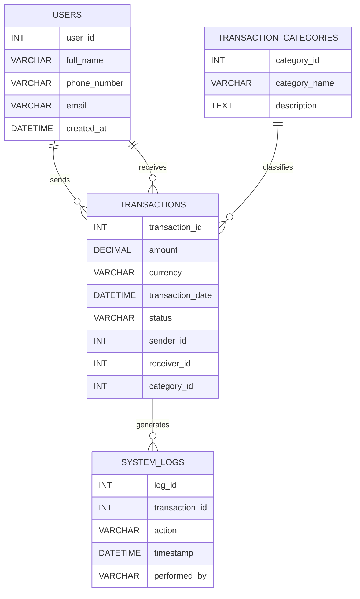

# MoMo SMS Analytics – Group work

Analyze MoMo SMS XML, clean and categorize transactions, store in a relational database, and visualize on a simple frontend dashboard.

## Team

* Team name: **Ctrl+Cash 💸**
* Members:

  * Emmanuel Dufitumukiza
  * Muhoza Olvier Yvan

---

## Repo Setup

1. One member creates a GitHub repo and invites teammates as collaborators.
2. Clone and set up Python 3.10+.
3. Create a virtualenv and install requirements:

   ```bash
   python -m venv .venv
   source .venv/bin/activate  # Windows: .venv\Scripts\activate
   pip install -r requirements.txt
   ```
4. Copy `.env.example` to `.env` and adjust paths if needed.

---

## Run ETL

```bash
bash scripts/run_etl.sh data/raw/momo.xml
```

## Export dashboard JSON (re-run analytics only)

```bash
bash scripts/export_json.sh
```

## Serve Frontend (static)

```bash
bash scripts/serve_frontend.sh
# open http://localhost:8000
```

## Optional API

```bash
uvicorn api.app:app --reload
# GET http://127.0.0.1:8000/transactions
# GET http://127.0.0.1:8000/analytics
```

---

## Project Structure

```
.
├── README.md
├── .env.example
├── requirements.txt
├── index.html
├── web/
│   ├── styles.css
│   ├── chart_handler.js
│   └── assets/
├── data/
│   ├── raw/
│   │   └── momo.xml
│   ├── processed/
│   │   └── dashboard.json
│   ├── db.sqlite3
│   └── logs/
│       └── etl.log
├── database/
│   └── database_setup.sql
├── examples/
│   └── json_schemas.json
├── docs/
│   ├── architecture.png
│   └── erd_diagram.png
├── etl/
│   ├── parse_xml.py
│   ├── clean_normalize.py
│   ├── categorize.py
│   ├── load_db.py
│   └── run.py
├── api/
│   ├── app.py
│   ├── db.py
│   └── schemas.py
├── scripts/
│   ├── run_etl.sh
│   ├── export_json.sh
│   └── serve_frontend.sh
└── tests/
    ├── test_parse_xml.py
    ├── test_clean_normalize.py
    └── test_categorize.py
```

---

## ERD Diagram (with Cardinality)



**Cardinality explained:**

* A **User** can send many Transactions (1 → M).
* A **User** can receive many Transactions (1 → M).
* A **Transaction Category** can classify many Transactions (1 → M).
* A **Transaction** can generate many System Logs (1 → M).

---

## Database Schema

* Full SQL implementation: [database/database\_setup.sql](database/database_setup.sql)
* Includes `CREATE TABLE`, constraints, indexes, and sample data inserts.
* Enforces rules like:

  * `CHECK (amount > 0)`
  * `UNIQUE(phone_number)`
  * `ENUM` for transaction status

---

## JSON Examples

* JSON representations of entities: [examples/json\_schemas.json](examples/json_schemas.json)
* Includes nested objects for transactions with users, categories, and logs.
* Demonstrates how relational data maps to API responses.

---

## Data Dictionary

| Table                       | Column               | Type          | Description                   |
| --------------------------- | -------------------- | ------------- | ----------------------------- |
| **Users**                   | user\_id (PK)        | INT           | Unique user identifier        |
|                             | full\_name           | VARCHAR(100)  | User’s full name              |
|                             | phone\_number        | VARCHAR(20)   | Unique phone number           |
|                             | email                | VARCHAR(100)  | Optional email                |
|                             | created\_at          | DATETIME      | Account creation timestamp    |
| **Transaction\_Categories** | category\_id (PK)    | INT           | Unique category identifier    |
|                             | category\_name       | VARCHAR(50)   | e.g. Deposit, P2P             |
|                             | description          | TEXT          | Category description          |
| **Transactions**            | transaction\_id (PK) | INT           | Unique transaction identifier |
|                             | amount               | DECIMAL(12,2) | Transaction amount (>0)       |
|                             | currency             | VARCHAR(10)   | Default RWF                   |
|                             | transaction\_date    | DATETIME      | Transaction timestamp         |
|                             | status               | ENUM          | SUCCESS, FAILED, PENDING      |
|                             | sender\_id (FK)      | INT           | Linked to Users               |
|                             | receiver\_id (FK)    | INT           | Linked to Users               |
|                             | category\_id (FK)    | INT           | Linked to Categories          |
| **System\_Logs**            | log\_id (PK)         | INT           | Unique log identifier         |
|                             | transaction\_id (FK) | INT           | Linked to Transactions        |
|                             | action               | VARCHAR(100)  | e.g. Parsed XML               |
|                             | timestamp            | DATETIME      | Log entry time                |
|                             | performed\_by        | VARCHAR(50)   | Actor (system/user)           |

---

## Design Rationale

The schema was designed for **data integrity, scalability, and auditability**. Users are uniquely identified by phone numbers, Transactions capture sender/receiver relationships, and categories allow flexible classification. System logs support traceability and debugging. Indexes on `transaction_date`, `sender_id`, and `receiver_id` improve performance. Constraints like `amount > 0` and unique phone numbers enforce accuracy. This structure ensures reliable querying and reporting while supporting future scaling.

---

## Scrum Board

**Board link:** [Project Board](https://github.com/users/EmmanuelDufitumukiza/projects/1/views/1)

